# Assentry

**Source:** `ai-in-health/Accenture-Digital-Health-Technology-Vision-2017-Trend-1/`
**Domain:** `ai-health`
**One-liner:** A consent and purpose control plane for consumer-facing health AI, which binds every assistant answer to a revocable, purpose-scoped data grant, records where the answer came from and how long it stays true, and gives the member a readable ledger of what was used and what they were told.
**Wedge:** Health plans with 500,000 to 5 million members launching a member assistant across app, web chat, messaging, and voice, where legal has capped the assistant at published-FAQ answers because no one can evidence the consent basis for touching claims, benefits, or clinical history.
**Positioning:** Trust infrastructure for AI as an interface, not a chatbot platform and not an enterprise consent-management suite. Consent tools record a member's preferences; Assentry sits in the request path, decides per answer whether this channel may use this data category for this purpose, and produces the disclosure record that makes a personalised health assistant defensible to a privacy regulator, a member, and the clinician the member later quotes it to.

## Market research synthesis

### Thesis from source

The source argues that artificial intelligence has moved from a back-end tool to the front of the healthcare experience — its framing is that AI is the new user interface. It gives AI three named roles: **curator**, suggesting relevant options based on previous behaviour or patterns, applied to health insurance plans and care management plans; **advisor**, learning from the user but also taking action or guiding them toward an optimal outcome, applied to patients and physicians; and **orchestrator**, learning from past actions and collaboration tasks across multiple channels to achieve outcomes, applied to care, lifestyle, and health benefits. It states that people will direct and control AI to fit their lifestyle and healthcare needs and goals.

The document is unusually explicit about what makes those roles work, and that is the sentence the product is built on. Systems "will know about the healthcare consumers — their medical history, allergies, past procedures and lifestyle behaviors — and use that information to guide personalized experiences." The examples it gives are concrete and consequential: "This is what your procedure will cost," "Here are your medical benefits," and "Contact your doctor when you experience this symptom." It anticipates that the answers will arrive through channels the healthcare organisation does not own, noting that a consumer can "simply ask Amazon Alexa for information at the point of need." It describes the data supply widening further, from personal health devices and internet-of-health-things solutions to DNA testing and genome sequencing alongside the medical record. Its market evidence: 84% of healthcare executives believe AI will revolutionise how they gain information from and interact with customers, 81% say offering their products and services through centralised platforms, assistants, or messaging bots is extremely or very important, and 72% of health organisations are already using intelligent virtual assistants. It cites HealthTap's Dr. A.I., launched in 2016, translating symptoms into doctor-recommended courses of action across a network of more than 107,000 doctors in 174 countries, and on the back-office side names prior authorisation and underwriting as processes AI can relieve.

What the document does not resolve is the trust mechanics, and the gap is structural rather than incidental. The usefulness of an AI interface is directly proportional to how much of a person's health life it can see; the source's own list — history, allergies, procedures, lifestyle behaviours, genomics, device streams, benefits — is a near-complete inventory of the most sensitive data a person has. Meanwhile the delivery surface it describes is distributed across a household voice device, a third-party messaging platform, and a consumer app, each of which sits outside the covered entity's four walls and may be governed by nothing stronger than a privacy policy. A blanket terms-of-use acceptance cannot carry that load: it does not tell the member that answering "what will my knee replacement cost" required their claims history, it does not distinguish a benefits question from a behavioural-health question, and it cannot be revoked for one purpose while kept for another.

Two further properties of the source's own examples deserve product treatment. First, curation is not neutral. When an assistant suggests plan options or care management programmes, the suggester frequently has an economic interest in the option — an owned facility, a preferred network, a lower-cost site of care. The source names curation as a core role without naming the disclosure obligation that follows. Second, the source's flagship answers are perishable facts, not opinions. A cost estimate and a benefits statement are true only as of a coverage year, an accumulator balance, a network status, and a fee schedule; an assistant that repeats yesterday's number confidently has not made a mistake the member can detect. Anything that says "this is what your procedure will cost" therefore needs a traceable source of truth and a validity window attached to the answer, and a route for the member to dispute what they were told and be answered from the record.

### Buyer & economic model

- **Primary buyer:** Chief Digital Officer or VP of Consumer and Member Experience at a health plan, co-sponsored by the Chief Privacy Officer, who can otherwise veto the whole programme, and the Chief Compliance Officer, who owns the regulatory exposure. Provider systems buy the same capability for patient-facing assistants.
- **Users:** conversational and digital product managers, privacy analysts, compliance and regulatory reviewers, member services agents who inherit the escalations, security engineers, the market conduct or appeals function that handles disputes, and members themselves, who are first-class users of the consent and disclosure surfaces rather than subjects of them.
- **Budget owner / value metric:** the digital member-experience budget, defended by the contact-centre cost it displaces. The value metric is depth of usable personalisation per member — the share of members who have granted the scopes that make the assistant more than an FAQ — multiplied by containment achieved without a privacy incident, plus reduction in privacy complaints and in escalations caused by wrong or stale answers.
- **Competing status quo:** a terms-of-use checkbox and a notice of privacy practices, a channel-by-channel legal review that takes a quarter per feature, bot transcripts stored in a marketing analytics tool with no retention discipline, and a standing prohibition on the assistant touching clinical or claims data at all — which is the cheapest way to stay compliant and the reason most member assistants answer nothing a member could not find on the website.

### Domain constraints

- **Regulatory / trust / safety:** the boundary between a covered entity, its business associates, and a consumer application the member controls determines what may flow where and on what basis; a disclosure to a member-directed third-party assistant is a different legal act from an internal use, and both must be evidenced. Minimum necessary applies to each answer, not to the integration. Special-category data under GDPR requires an explicit consent basis and purpose limitation, and revocation must be real rather than nominal. Substance-use-disorder records carry their own consent regime with redisclosure restrictions, and genetic information carries state-level constraints that survive a general consent. Outbound proactive messaging brings communication-consent rules into scope. Accessibility and language-access obligations apply to the consent interface itself, not only to the assistant. Curation that steers toward economically interested options raises inducement and steering exposure that must be disclosed. And where an assistant's guidance crosses from information into a recommendation about seeking care, the function's regulatory character must be assessed rather than assumed.
- **Data sensitivity:** the data categories that make personalisation valuable are precisely the ones whose exposure is most damaging — behavioural health, substance use, reproductive health, HIV status, gender identity, genetic results. Voice and household channels add a distinctive risk the industry under-manages: the person present when the answer is spoken may not be the member, so co-presence is a data-protection variable, not a user-experience detail. Transcripts are a second copy of sensitive disclosures and need their own retention and access discipline. And the assistant's own logs, if used to improve models, constitute a secondary use requiring its own basis.
- **Change-management realities:** product teams ship weekly and legal reviews monthly, so approval has to become a configuration the product team can read and a policy the privacy team can change without a release. Members will not read a long consent, so grants must be narrow, plain, contextual, and reversible in one action, requested at the moment the answer needs them rather than at onboarding. Member services will receive the fallout of every wrong answer, so agents need to see what the assistant said and on what basis. And the organisation must accept that a member who revokes a scope will get a less useful assistant — degradation must be graceful and explained rather than hidden.

## Business requirements

- BR-1: No ai-mediated answer may use a member's data unless a grant is in force naming the data categories, the purpose, the channel, and an expiry, and every use must be attributable to a specific grant rather than to a general acceptance of terms.
- BR-2: Members must be able to revoke any grant in a single action, revocation must take effect before the next answer, and the member must be told plainly which capabilities they will lose rather than discovering degradation silently.
- BR-3: Heightened-sensitivity categories — behavioural health, substance use, reproductive health, HIV status, gender identity, genetic results — must require their own explicit, separately worded grant, must never be inferable from an answer given under a general grant, and must be excluded from any channel not individually approved for them.
- BR-4: Each channel must be separately registered and approved for a defined set of purposes and data categories, with unapproved combinations refused at request time; a channel outside the covered-entity boundary must additionally record the legal instrument permitting the flow.
- BR-5: Identity assurance must be proportionate to the sensitivity of the answer requested, and an assistant must be able to answer a general benefits question at a lower assurance level than a clinical-history question without forcing the member through the highest bar for everything.
- BR-6: Voice and shared-device channels must apply co-presence controls, so that a sensitive answer is withheld, summarised, or moved to a private channel rather than spoken into a room, and the control decision must be recorded.
- BR-7: Any answer stating a cost, a benefit, an accumulator balance, a network status, or a coverage determination must carry its source of truth and a validity window, and must not be served once stale; where the source is unavailable the assistant must say so rather than estimate.
- BR-8: Where curation presents options in which the organisation has an economic interest, that interest must be disclosed to the member in the answer, and the disclosure must be retained as evidence.
- BR-9: Every member must be able to obtain a readable ledger of what data was used, for which purpose, on which channel, and what they were told, covering a defined history period and delivered without a special request process.
- BR-10: A member must be able to dispute what an assistant told them, the dispute must be answered from the recorded interaction and its provenance rather than from a reconstruction, and disputes must be counted and reported as a quality measure.
- BR-11: Use of interaction transcripts to improve models is a distinct purpose requiring its own grant, and refusing it must not degrade the member's access to the assistant.
- BR-12: Retention must be defined per data category and per channel with the shortest schedule that supports dispute resolution and safety review, and deletion must be evidenced rather than asserted.

## User stories

Canonical user stories live in sibling [USER_STORIES.md](USER_STORIES.md).

## System design

### Overview

Assentry sits in the request path between an assistant and the data it wants. When a channel asks a question on a member's behalf, the request declares the purpose it serves and the data categories it needs. Assentry resolves the member's identity to an assurance level, evaluates the request against registered channel approvals, purpose definitions, active grants, sensitive-segment policy, and co-presence conditions, and returns an allow, a narrowed allow, or a refusal with a reason the assistant can turn into an honest sentence. Where an answer asserts a perishable fact, Assentry binds the source of truth and validity window to the answer before it is served. Every decision, every answer, and every disclosure lands in a ledger that the member can read and that member services and the appeals function can work from. Grants are requested contextually at the moment of need, revoked in one action, and enforced on the next request. Policy is data: privacy can narrow a scope, retire a purpose, or suspend a channel without a product release.

### Actors & boundaries

- **Actors:** the member, the assistant channel (owned app, web chat, messaging platform, voice device, third-party consumer application), the digital product team, privacy and compliance, member services agents, the appeals or market-conduct function, security, and the platform administrator.
- **Trust boundary:** the grant is the boundary. Channels receive answers, never bulk data, and never a data category outside the purpose they declared; a channel outside the covered-entity boundary additionally requires a recorded legal instrument, and its approval expires with that instrument. The decision engine cannot be overridden by the product team it constrains, and no path exists for a channel to enumerate a member's sensitive segments — a refusal must not itself reveal that a segment exists.
- **Human-in-the-loop points:** approval of each channel and purpose pairing; wording review for grant requests and steering disclosures; approval of a sensitive-segment exception; adjudication of member disputes; and administrator action on channel suspension and retention exceptions.

### Core capabilities

1. **Identity and assurance** — resolves the member and the assurance level achieved, with step-up requested only for the sensitivity actually needed.
2. **Purpose and scope registry** — the catalogue of purposes and data categories in plain member-readable language, including the sensitive segments that require separate wording.
3. **Channel registry** — registration and approval of each channel for specific purposes and categories, with the legal instrument, expiry, and co-presence characteristics recorded.
4. **Grant management** — contextual, narrow, expiring grants; one-action revocation; graceful-degradation mapping from missing grants to narrower answers.
5. **Access decisioning** — per-request evaluation returning allow, narrowed allow, or refusal with a member-safe reason, enforced before any data is read.
6. **Co-presence control** — withhold, summarise, or redirect a sensitive answer on shared and voice channels, with the decision recorded.
7. **Answer provenance** — source of truth, verification time, and validity window bound to any answer asserting cost, benefit, accumulator, network, or coverage facts, with staleness refusal.
8. **Steering disclosure** — detection of economically interested curation and enforcement of the disclosure in the answer.
9. **Interaction and disclosure ledger** — member-readable record of data used, purpose, channel, and what was said, with agent and appeals views.
10. **Dispute handling** — member-initiated disputes answered from the recorded interaction and provenance, with outcomes reported as a quality measure.
11. **Retention and deletion** — per-category, per-channel schedules with evidenced deletion, including transcripts and model-improvement copies.
12. **Policy administration** — scope narrowing, purpose retirement, and channel suspension effective on the next request without a release.

### Conceptual data

- **Primary entities:** Person, IdentityAssuranceRecord, DataScope, PurposeDefinition, ChannelRegistration, RecipientAgreement, ConsentGrant, SensitiveSegmentPolicy, AccessDecision, CoPresenceControl, InteractionRecord, AnswerProvenance, SteeringDisclosure, DisclosureLedgerEntry, DisputeCase, RetentionSchedule.
- **Critical events:** grant requested, granted, narrowed, expired, revoked; assurance level achieved or stepped up; access allowed, narrowed, or refused; sensitive segment withheld; answer served with provenance; answer refused as stale; steering disclosure presented; co-presence control applied; ledger viewed by the member; dispute opened and resolved; channel approval lapsed and suspended; retention schedule executed with deletion evidence.
- **Retention / audit needs:** access decisions, grants, and disclosures retained long enough to answer a privacy regulator and to resolve disputes across a coverage year, with an immutable record of the policy in force at decision time, because the reconstructable question is what the member was asked, what they permitted, and what they were told. Transcripts and answer bodies retained on the shortest schedule that supports dispute resolution, held separately from decision metadata so that deleting content does not destroy the audit trail. Sensitive-segment data held under separate segmentation with stricter access logging, and model-improvement copies held only under their own grant and deleted with it.

### Integrations (conceptual)

- **Systems of record:** the claims and benefits administration platform for coverage, accumulators, and network status; the clinical record or health information exchange for history, allergies, and procedures; the care management platform for programme enrolment; the member master and identity provider; the contact-centre platform.
- **Upstream signals:** cost-estimation and fee-schedule services that supply the perishable facts and their validity windows, personal device and remote-monitoring streams, consumer genomics results where the member has connected them, eligibility feeds, and the legal instrument register that governs external recipients.
- **Downstream actions:** answers and refusal reasons returned to the channel, grant requests rendered in the channel's own interface, step-up authentication challenges, private-channel redirects from a shared device, agent context delivered into the contact-centre desktop, disputes routed to appeals, deletion instructions issued to downstream stores, and channel suspension notices to product teams.

### High-level architecture

Every path to member data passes the decision point; nothing about a member is returned to a channel without a grant, a purpose, and — where the answer asserts a perishable fact — a provenance record.

```mermaid
flowchart TD
    subgraph channelsurf [Assistant channels]
        App[Owned member app]
        Web[Web chat]
        Msg[Messaging platform]
        Voice[Voice and shared device]
        Thirdparty[Member directed third party app]
    end
    subgraph controlplane [Assentry control plane]
        Identity[Identity and assurance]
        Registry[Purpose and scope registry]
        Chanreg[Channel registry and instruments]
        Grants[Grant management]
        Decide[Access decisioning]
        Copresence[Co-presence control]
        Provenance[Answer provenance binding]
        Steering[Steering disclosure]
    end
    subgraph evidence [Evidence and member surfaces]
        Ledger[(Interaction and disclosure ledger)]
        Memberview[Member readable history]
        Disputes[Dispute adjudication]
        Retention[Retention and deletion]
    end
    subgraph sources [Systems of record]
        Claims["Claims, benefits, accumulators"]
        Clinical["Clinical history, allergies, procedures"]
        Caremgmt[Care management programmes]
        Costsvc[Cost estimation and fee schedules]
        Devices[Devices and consumer genomics]
    end
    subgraph humans [Human operations]
        Agents[Member services desktop]
        Privacy[Privacy and compliance administration]
    end

    App --> Decide
    Web --> Decide
    Msg --> Decide
    Voice --> Copresence
    Thirdparty --> Decide
    Copresence --> Decide
    Identity --> Decide
    Registry --> Decide
    Chanreg --> Decide
    Grants --> Decide
    Decide --> Provenance
    Costsvc --> Provenance
    Claims --> Provenance
    Clinical --> Decide
    Caremgmt --> Steering
    Devices --> Decide
    Steering --> Ledger
    Provenance --> Ledger
    Decide --> Ledger
    Copresence --> Ledger
    Ledger --> Memberview
    Ledger --> Agents
    Ledger --> Disputes
    Disputes --> Ledger
    Privacy --> Registry
    Privacy --> Chanreg
    Privacy --> Retention
    Retention --> Ledger
    Grants --> Memberview
```

### Success metrics

- **Leading:** share of members holding at least one grant beyond the baseline scope; average number of purposes granted per member; step-up authentication completion rate by sensitivity tier; share of answers asserting perishable facts that carried provenance and were inside their validity window; refusal rate with a member-safe reason versus hard error rate; co-presence controls applied on shared-device sessions; median time from policy change to enforcement.
- **Lagging:** assistant containment and self-service rate achieved without a privacy incident; privacy complaints and regulator enquiries per million interactions; disputes opened and share resolved from the record within the service level; grant revocation rate and the reasons given; contact-centre volume displaced net of escalations caused by assistant answers; member-reported trust in the assistant relative to the same members' trust in the organisation overall.

## OpenAPI skeleton

Canonical HTTP surface lives in sibling [openapi.yaml](openapi.yaml). Summary:

- **Base path:** `/v1/...`
- **Auth:** `X-API-Key` for registered assistant channels making access decisions and serving answers; Bearer JWT for member-facing surfaces acting on the member's own record and for privacy, compliance, and agent consoles, with policy administration and dispute resolution restricted by role.
- **Resource groups:** Identity, Purposes & Scopes, Channels, Consent Grants, Access Decisions, Interaction Ledger, Answer Provenance, Disputes & Governance.
