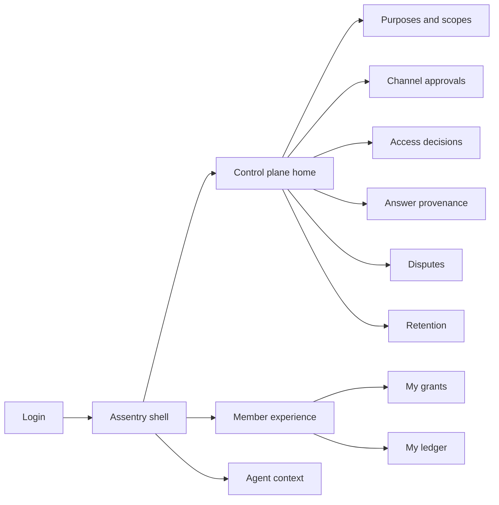
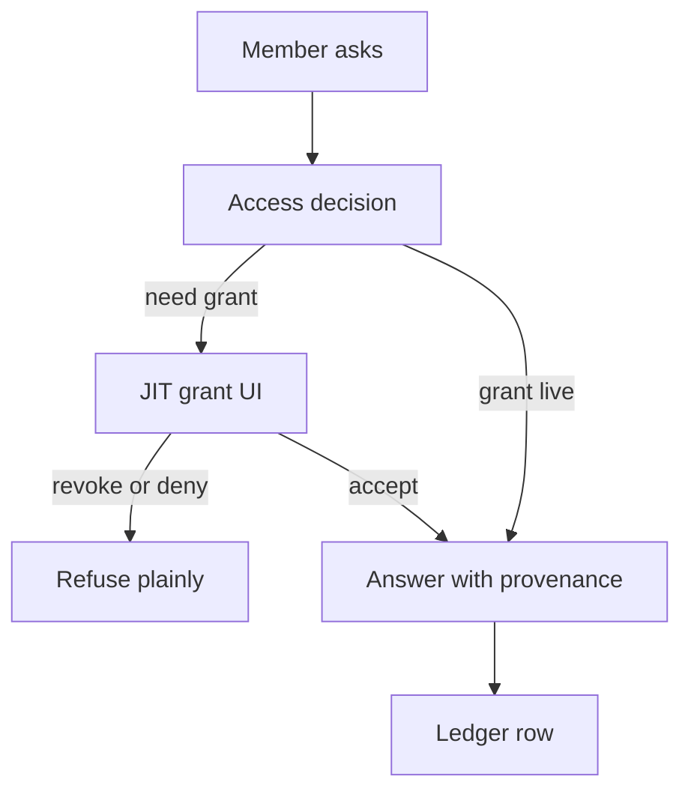

# Assentry — Web app

**Product:** [PRODUCT.md](./PRODUCT.md)
**Primary surface:** Consent-and-purpose control plane console (privacy + digital product shell)
**Secondary surfaces:** Member grant-and-ledger experience (member-facing); member-services agent context viewer (read-only interaction replay)
**Design thesis:** Assentry is a request-path lock for personalised health answers — not a chatbot builder and not a generic CMP preference centre. The metaphor is a purpose-scoped key cabinet: each answer opens only the drawers named on a live grant, stamped with source-of-truth and a validity window, then logged in a member-readable ledger. Visual language is soft privacy mist and grant-green on cool porcelain — revokes feel instantaneous; stale benefits answers feel expired, not “AI confident.” The Assentry wordmark appears on every ledger export so a regulator, member, or quoting clinician knows whose control plane produced the disclosure record.

## UX research synthesis

### Category peers (best-in-class)

- **Apple Health / Health app sharing (granular health permissions):** Category-level share with plain-language consequences. Steal: separate heightened-sensitivity grants; reject all-or-nothing Terms acceptance as the assistant’s basis.
- **OneTrust / BigID (enterprise privacy ops):** Purpose registers, retention schedules, deletion evidence. Steal: purpose/channel matrices and evidenced deletion; reject cookie-banner UX as the member grant moment.
- **Plaid Link / financial consent patterns:** Contextual permission at the moment of need with revoke. Steal: just-in-time grants tied to the answer about to be given; reject banking neon as health aesthetic.
- **Amazon Alexa privacy / voice co-presence controls (consumer):** Whisper/private-mode instincts for spoken answers. Steal: co-presence as a recorded control decision; reject always-speak-everything assistant demos.

### Patterns to adopt / reject

- **Adopt:** Grant = categories × purpose × channel × expiry; revoke-before-next-answer; proportionate identity step-up; validity windows on cost/benefits answers; steering disclosures; member ledger self-serve; model-improvement as separate opt-in that never degrades access.
- **Reject:** Chatbot transcript as system of record without provenance; onboarding mega-consent; estimating stale accumulators; burying economic interest in footnotes; purple “conversational AI” marketing chrome as operator home.

### Trust, density, and workflow constraints from PRODUCT.md

Every data use must cite a grant (BR-1). Revocation is immediate and capability loss is explained (BR-2). Heightened categories never ride a general grant (BR-3). Channels are approved matrices, not free routing (BR-4). Voice needs co-presence controls (BR-6). Perishable facts need source + validity (BR-7). Disputes resolve from the record (BR-10). Product ships weekly; privacy changes policy without a release — configuration over code.

## Information architecture

### Nav model

### Roles → default home

| Role | Default home | Why |
|------|--------------|-----|
| Privacy / compliance officer | Control plane home — refuses + grants health | Policy without release (BR-1, BR-4) |
| Digital product owner | Channels + purposes matrix | Ship weekly inside approved combos |
| Member | My grants / My ledger | Revoke and readable history (BR-2, BR-9) |
| Member services agent | Agent context viewer | Replay what was told (BR-10) |
| Security / identity | Assurance sessions | Proportionate step-up (BR-5) |
| Quality / dispute ops | Disputes queue | Quality measure (BR-10) |

### Cross-links to OpenAPI resources

| Nav area | OpenAPI tags / resources |
|----------|---------------------------|
| Assurance sessions, step-up | Identity |
| Purposes, restrictions, data scopes, sensitive policies | Purposes and Scopes |
| Channel registration, approvals, suspension | Channels |
| Member grants, revocation | Consent Grants |
| Access decisions, co-presence | Access Decisions |
| Interactions, member ledger, agent context | Interaction Ledger |
| Answer provenance, validity, steering disclosures | Answer Provenance |
| Disputes, retention, deletion evidence | Disputes and Governance |

## Screen inventory

### Control plane home

- **Purpose:** Answer “which answer types are blocked for lack of grant, channel, or stale provenance?”
- **Entry:** Privacy/product default.
- **Layout regions:** Brand; refuse rate by reason; heightened-category grant uptake; stale-answer blocks; open disputes; channel health.
- **Primary actions:** Open matrix; suspend channel; open dispute spike.
- **Empty / loading / error:** Empty refuses with capture lag warning if decision feed down.
- **BR / story ties:** BR-1, BR-4, BR-7.

### Purposes and data scopes

- **Purpose:** Define purposes (curator/advisor/orchestrator jobs) and data categories with restrictions.
- **Entry:** Control nav.
- **Layout regions:** Purpose list; scope catalogue; sensitive-segment policies; model-improvement purpose isolated.
- **Primary actions:** Publish purpose; restrict; require separate wording for heightened categories.
- **Empty / loading / error:** Draft purposes cannot authorise live answers.
- **BR / story ties:** BR-1, BR-3, BR-11.

### Channel approvals

- **Purpose:** Register app/web/messaging/voice (and external) channels with approved purpose×category sets and legal instruments.
- **Entry:** Channels nav.
- **Layout regions:** Channel table; approval matrix; outside-covered-entity instrument; suspension control.
- **Primary actions:** Approve combo; suspend channel; refuse unapproved at request time (config preview).
- **Empty / loading / error:** Unapproved combo shows as hard refuse in simulator.
- **BR / story ties:** BR-4.

### Access decision explorer

- **Purpose:** Inspect per-answer allow/refuse with cited grant and co-presence outcome.
- **Entry:** From home refuses; support tools.
- **Layout regions:** Decision timeline; grant citation; assurance level used; co-presence control record; channel.
- **Primary actions:** Filter by refuse reason; open related interaction.
- **Empty / loading / error:** Missing grant citation = integrity fault state.
- **BR / story ties:** BR-1, BR-5, BR-6.

### Answer provenance desk

- **Purpose:** Attach source of truth and validity window to cost/benefits/network/coverage answers; block stale serve.
- **Entry:** Provenance nav; product config.
- **Layout regions:** Provenance records; validity countdown; unavailable-source script; steering disclosure library.
- **Primary actions:** Publish provenance binding; force “source unavailable” behaviour; attach economic-interest disclosure text.
- **Empty / loading / error:** Expired validity = auto-block with member-plain message.
- **BR / story ties:** BR-7, BR-8.

### Member grants

- **Purpose:** Contextual, plain-language grants; one-action revoke with capability-loss preview.
- **Entry:** Member app deep link at need; member home.
- **Layout regions:** Active grants; request-at-need sheet; heightened separate wording; model-improvement opt-in separate; revoke + loss list.
- **Primary actions:** Grant; revoke; adjust channel for sensitive categories.
- **Empty / loading / error:** Empty = FAQ-only mode explained, not a blank wall.
- **BR / story ties:** BR-1, BR-2, BR-3, BR-11.
- **Mobile notes:** Thumb-first revoke; large plain language; no dense legal PDF as the only UI.

### Member ledger

- **Purpose:** Readable history of data used, purpose, channel, and what was told — no special request.
- **Entry:** Member nav; post-interaction link.
- **Layout regions:** Chronological ledger rows; filters by period; export; dispute CTA per row.
- **Primary actions:** Export; open dispute; revoke related grant.
- **Empty / loading / error:** Empty period = “no personalised answers in range.”
- **BR / story ties:** BR-9, BR-10.

### Agent context viewer

- **Purpose:** Member services sees interaction + provenance + grant basis without reconstructing.
- **Entry:** Agent desk from CRM/case.
- **Layout regions:** Conversation summary; exact statements; provenance; grants cited; dispute status.
- **Primary actions:** Open dispute; escalate privacy.
- **Empty / loading / error:** Retention-lapsed interaction shows deletion evidence link, not silent gap.
- **BR / story ties:** BR-9, BR-10, BR-12.

### Disputes

- **Purpose:** Member disputes answered from recorded interaction; counted as quality measure.
- **Entry:** Member ledger; ops queue.
- **Layout regions:** Queue; case with immutable replay; resolution; quality dashboard counts.
- **Primary actions:** Resolve from record; report counts; feed product fix.
- **Empty / loading / error:** Empty = quality trend still visible.
- **BR / story ties:** BR-10.

### Retention and deletion evidence

- **Purpose:** Per category/channel shortest schedules; deletion evidenced.
- **Entry:** Governance nav.
- **Layout regions:** Schedule table; deletion evidence viewer; dispute-hold overrides.
- **Primary actions:** Update schedule; run evidenced deletion; export proof.
- **Empty / loading / error:** Asserted-without-evidence deletion blocked.
- **BR / story ties:** BR-12.

### Identity assurance console

- **Purpose:** Configure proportionate step-up by answer sensitivity.
- **Entry:** Security nav.
- **Layout regions:** Assurance tiers mapped to purposes; session debugger; step-up flows.
- **Primary actions:** Adjust mappings; test benefits-vs-clinical paths.
- **Empty / loading / error:** Misconfig that forces max assurance for all = warning.
- **BR / story ties:** BR-5.

## Key flows

1. **Just-in-time grant → answer** — member asks → access decision checks channel matrix → request grant if missing → cite grant → attach provenance → ledger row; failure: refuse with plain reason.

2. **Revoke before next answer** — one-action revoke → capability-loss preview → next request refuses revoked scopes.

3. **Voice co-presence** — sensitive intent on shared device → withhold/summarise/move private → record control decision.

4. **Stale benefits block** — validity expires → do not serve estimate → say source unavailable or refresh.

5. **Dispute from ledger** — member disputes row → agent/ops resolve from recorded interaction + provenance → quality count.

## Design system

### Tokens (CSS variables)

- `--color-ink: #1A2430` — primary text
- `--color-porcelain: #F5F7F9` — app ground
- `--color-mist: #DCE6EE` — panels / grant sheets
- `--color-grant: #1F8A70` — active grant / allow
- `--color-refuse: #B5463A` — refuse / revoke confirm
- `--color-stale: #A67C1A` — expired validity
- `--color-sensitive: #5B4B8A` — heightened category (label + pattern, not only hue)
- `--color-brand: #2A4A5C` — Assentry wordmark (quiet privacy slate)
- `--font-display: "Literata", serif` — ledger titles and revoke confirmations
- `--font-body: "IBM Plex Sans", sans-serif`
- `--font-mono: "IBM Plex Mono", monospace` — grant ids, provenance ids, validity stamps
- `--space-1`…`--space-8`: 4px scale
- `--radius-sm: 6px`; `--radius-md: 12px` — member sheets slightly softer than ops tables
- `--motion-revoke: 150ms ease-out` — immediate revoke feedback
- `--motion-stale: 200ms ease-in-out` — validity expire
- `--motion-ledger: 180ms ease-out` — new ledger row appear
- Atmosphere: soft vertical mist gradient; no chatbot bubble wallpaper in the control plane.

### Typography & brand

- Display for member ledger and revoke consequences; body for matrices; mono for ids and validity.
- Brand on control home and every member ledger export.
- Member first viewport: brand + one line (“You control what the assistant may use”) + primary grant/ledger CTA — no stat strip.

### Do / don’t

- **Do:** Cite grants on decisions; explain revoke loss; separate heightened wording; block stale facts; disclose steering.
- **Don’t:** Mega-consent onboarding; estimate when source is down; purple bot mascots; hide model-training opt-out behind degraded UX.

### Accessibility & domain trust cues

- AA+; sensitive categories not colour-only.
- Live regions for revoke confirmation and refuse reasons.
- Language-access ready grant copy fields.
- Focus order member: purpose plain text → grant → revoke.

## Component patterns

- **GrantScopeChip** — category × purpose × channel × expiry.
- **RevokeConsequenceList** — capabilities lost, shown before confirm.
- **HeightenedGrantSheet** — separately worded sensitive grant.
- **AccessDecisionTrace** — allow/refuse with grant citation.
- **ValidityWindowBadge** — source + expires-at; blocks when stale.
- **SteeringDisclosureLine** — economic interest in curated options.
- **MemberLedgerRow** — data used, purpose, channel, what was told, dispute.
- **CoPresenceControl** — withhold / summarise / private-channel outcome.

## Out of scope for v1 web

- LLM prompt IDE / bot persona studio; full CDP; call-centre telephony softphone; native OS voice skills beyond channel registration; clinician EHR inbox; marketing journey builders; selling ledger data.
